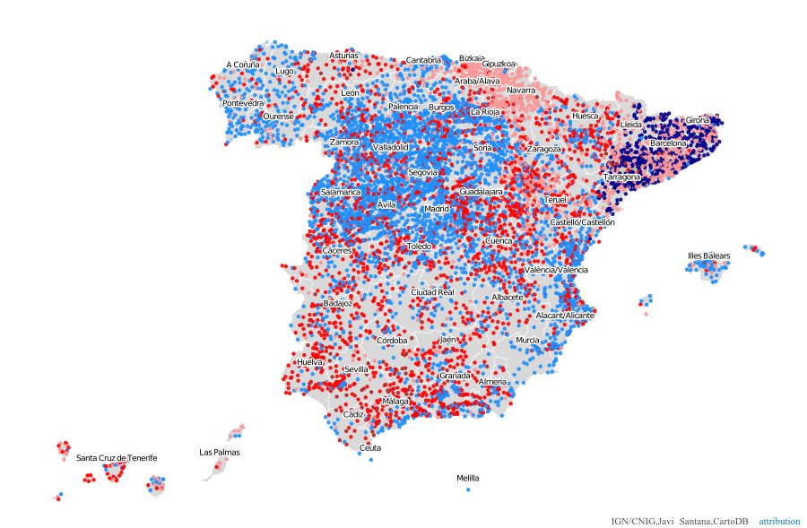
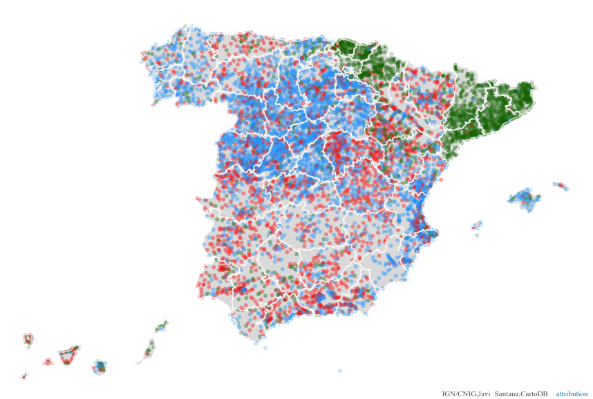
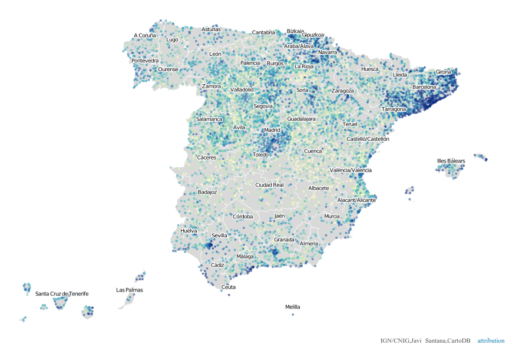
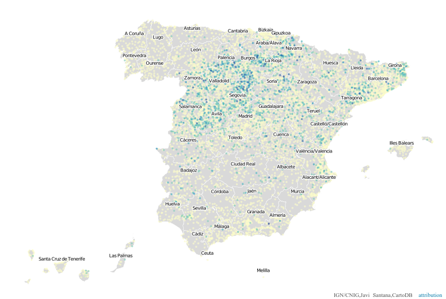

# Mapas de puntos por municipio

Es posible utilizar los datos puntuales directamente, tienen la ventaja sobre la agregación que informan sobre la distribución de la población y obviamente dan más detalle, aunque también pueden ser difíciles de leer.

## Mapa de partido más votado



SQL:

```sql
SELECT * FROM resultados_elecciones
```

CartoCSS:

```css
/** category visualization */

#resultados_elecciones {
   marker-fill-opacity: 0.9;
   marker-line-color: #FFF;
   marker-line-width: 0;
   marker-line-opacity: 1;
   marker-placement: point;
   marker-type: ellipse;
   marker-width: 4.5;
   marker-allow-overlap: true;
}

#resultados_elecciones[primer_partido_cat="BNG"] {
   marker-fill: #A6CEE3;
}
#resultados_elecciones[primer_partido_cat="CiU"] {
   marker-fill: #00008b;
}
#resultados_elecciones[primer_partido_cat="ERC"] {
   marker-fill: #B2DF8A;
}
#resultados_elecciones[primer_partido_cat="IU"] {
   marker-fill: #b22222;
}
#resultados_elecciones[primer_partido_cat="Otros"] {
   marker-fill: #FB9A99;
}
#resultados_elecciones[primer_partido_cat="PNV"] {
   marker-fill: #E31A1C;
}
#resultados_elecciones[primer_partido_cat="PP"] {
   marker-fill: #1e90ff;
}
#resultados_elecciones[primer_partido_cat="PSOE"] {
   marker-fill: #ff0000;
}
#resultados_elecciones[primer_partido_cat="UPyD"] {
   marker-fill: #CAB2D6;
}
#resultados_elecciones[primer_partido_cat="Amaiur"] {
   marker-fill: #008080;
}

#provincias::labels[zoom>9] {
  text-name: [municipality_name];
  text-face-name: 'DejaVu Sans Book';
  text-size: 7;
  text-label-position-tolerance: 0;
  text-fill: #000;
  text-halo-fill: #FFF;
  text-halo-radius: 1.5;
  text-dy: -10;
  text-allow-overlap: false;
  text-placement: point;
  text-placement-type: dummy;
  
  
  [zoom>10]{text-size:12}
  [zoom>11]{text-size:14}
  [zoom>12]{text-size:22}
}
```

A esta capa se le añade la capa de provincias por debajo en gris y otra vez por encima solo para pintar los bordes y el etiquetado para dar contexto. Este procedimiento se seguirá en el resto de mapas de esta sección.

El resultado en [este mapa](https://jsanzacademy1.cartodb.com/viz/56d93ee0-6ec4-11e5-b53e-0ea31932ec1d/public_map).


## Bipartidismo


En los resultados de las elecciones tenemos los tres partidos más votados. Podemos hacer un mapa que indique aquellos municipios donde **no** hay un tercer partido.

SQL:

```sql
SELECT *,
CASE WHEN tercer_partido_nombre like 'unknown' THEN 'Sí'
ELSE 'No' END bipartido
FROM resultados_elecciones 
```

CartoCSS:

```css
/** category visualization */

#resultados_elecciones {
   marker-fill-opacity: 0.4;
   marker-line-color: #FFF;
   marker-line-opacity: 0;
   marker-placement: point;
   marker-type: ellipse;
   marker-width: 4; 
   marker-allow-overlap: true;
}

#resultados_elecciones[bipartido="No"] {
   marker-fill: #229A00;
}
#resultados_elecciones[bipartido="Sí"] {
   marker-fill: #F84F40;
}
```

El resultado es [este mapa](https://jsanzacademy1.cartodb.com/viz/ae11e5d4-6ecb-11e5-9bdd-0e787de82d45/public_map).


## PSOE versus PP



Este mapa muestra únicamente en qué partidos han obtenido más votos estos dos partidos dejando el resto en un color único para todos los demás.

SQL:

```sql
SELECT * FROM resultados_elecciones
```

CartoCSS:

```css
/** intensity visualization */


#resultados_elecciones{
  marker-fill:#136400;
  marker-width: 6; 
  marker-line-color: #FFF;
  marker-line-opacity: 0; 
  marker-fill-opacity: 0.4;
  marker-type: ellipse; 
  marker-placement: point; 
  marker-allow-overlap: true; 
  marker-clip: false; 
  marker-multi-policy: largest; 
  
  [zoom>7]{marker-width:12}
  [zoom>9]{marker-width:14}
  [zoom>10]{marker-width:16}
  [zoom>11]{marker-width:18}
}


#resultados_elecciones[primer_partido_cat="PP"] {marker-fill: #1e90ff; }
#resultados_elecciones[primer_partido_cat="PSOE"] {marker-fill: #ff0000; }


#provincias::labels[zoom>9] {
  text-name: [municipality_name];
  text-face-name: 'DejaVu Sans Book';
  text-size: 7;
  text-label-position-tolerance: 0;
  text-fill: #000;
  text-halo-fill: #FFF;
  text-halo-radius: 1.5;
  text-dy: -10;
  text-allow-overlap: false;
  text-placement: point;
  text-placement-type: dummy;
  
  
  [zoom>10]{text-size:12}
  [zoom>11]{text-size:14}
  [zoom>12]{text-size:22}
}
```

El resultado se puede consultar en [este mapa](https://jsanzacademy1.cartodb.com/viz/766c4ffc-6ec6-11e5-874d-0e3ff518bd15/public_map)


## Abstenciones



Este es de nuevo un mapa sencillo y el único 'truco' sería que hay que ordenar los datos por la variable que vamos a usar para simbolizar para así tener los puntos de mayor valor sobre el resto ya que el renderizador pinta los puntos conforme le llegan de la consulta.

SQL:

```sql
SELECT *
FROM resultados_elecciones 
ORDER BY abstencion_percent
```

CartoCSS:

```css
/** choropleth visualization */

#resultados_elecciones{
  marker-fill-opacity: 0.6;
  marker-line-color: #FFF;
  marker-line-width: 0;
  marker-line-opacity: 1;
  marker-width: 4;
  marker-fill: #FFFFCC;
  marker-allow-overlap: true;
}
#resultados_elecciones [ abstencion_percent <= 100] {
   marker-fill: #0C2C84;
}
#resultados_elecciones [ abstencion_percent <= 40.23] {
   marker-fill: #225EA8;
}
#resultados_elecciones [ abstencion_percent <= 30.43] {
   marker-fill: #1D91C0;
}
#resultados_elecciones [ abstencion_percent <= 24.91] {
   marker-fill: #41B6C4;
}
#resultados_elecciones [ abstencion_percent <= 19.92] {
   marker-fill: #7FCDBB;
}
#resultados_elecciones [ abstencion_percent <= 15.14] {
   marker-fill: #C7E9B4;
}
#resultados_elecciones [ abstencion_percent <= 10.3] {
   marker-fill: #FFFFCC;
}
```

El resultado es [este mapa](https://jsanzacademy1.cartodb.com/viz/6b40d03a-6ecb-11e5-9096-0ecfd53eb7d3/public_map).


## Votos nulos



SQL:

```sql
SELECT *
FROM resultados_elecciones 
ORDER BY votos_nulos_percent
```

CartoCSS:

```css
/** choropleth visualization */

#resultados_elecciones{
  marker-fill-opacity: 0.6;
  marker-line-color: #FFF;
  marker-line-width: 0;
  marker-line-opacity: 1;
  marker-width: 4;
  marker-fill: #FFFFCC;
  marker-allow-overlap: true;
}
#resultados_elecciones [ votos_nulos_percent <= 62.5] {
   marker-fill: #0C2C84;
}
#resultados_elecciones [ votos_nulos_percent <= 30.66] {
   marker-fill: #225EA8;
}
#resultados_elecciones [ votos_nulos_percent <= 12.31] {
   marker-fill: #1D91C0;
}
#resultados_elecciones [ votos_nulos_percent <= 8.86] {
   marker-fill: #41B6C4;
}
#resultados_elecciones [ votos_nulos_percent <= 5.97] {
   marker-fill: #7FCDBB;
}
#resultados_elecciones [ votos_nulos_percent <= 3.23] {
   marker-fill: #C7E9B4;
}
#resultados_elecciones [ votos_nulos_percent <= 3.2] {
   marker-fill: #FFFFCC;
}
```


El resultado es [este mapa](https://jsanzacademy1.cartodb.com/viz/eac2b5a0-6ec9-11e5-81e7-0e3ff518bd15/public_map).
