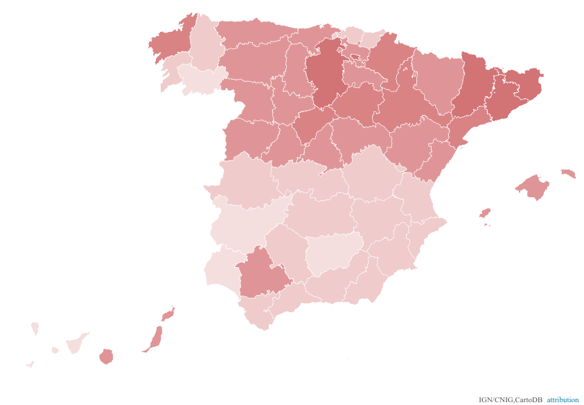

# Mapas agregados por provincia

Para agregar los datos por provincia utilizaremos las capacidades espaciales de la base de datos para agregar a cada provincia los datos de los municipios que intersectan con la misma.

## Nulos


SQL:

```sql
SELECT 
p.cartodb_id,
p.the_geom_webmercator,
p.nameunit,
to_char(
  sum(r.votos_nulos_number),
  '999 999'
) as total_nulos,
to_char(
  sum(r.total_votantes_number),
  '999 999 999'
) as total_votantes,
round(
  10000.0*
  sum(r.votos_nulos_number::float)/
  sum(r.total_votantes_number::float)
)/100 as nulos
FROM provincias p JOIN resultados_elecciones r
ON ST_Contains(p.the_geom,r.the_geom)
GROUP BY p.cartodb_id
```

CartoCSS:

```css
/** choropleth visualization */

#provincias{
  polygon-fill: #F2D2D3;
  polygon-opacity: 1;
  line-color: #FFF;
  line-width: 1;
  line-opacity: 1;
}
#provincias [ nulos <= 2.76] {
   polygon-fill: #C1373C;
}
#provincias [ nulos <= 2.23] {
   polygon-fill: #CC4E52;
}
#provincias [ nulos <= 1.83] {
   polygon-fill: #D4686C;
}
#provincias [ nulos <= 1.61] {
   polygon-fill: #EBB7B9;
}
#provincias [ nulos <= 1.3] {
   polygon-fill: #F2D2D3;
}
```

El resultado es [este mapa](https://jsanzacademy1.cartodb.com/viz/7822412e-6ecd-11e5-a5d7-0ecd1babdde5/public_map).


## Abstenciones


SQL:

```sql
SELECT 
p.cartodb_id,
p.the_geom_webmercator,
p.nameunit,
to_char(
  sum(r.abstencion_number),
  '999 999 999'
) as total_abstencion,
to_char(
  sum(r.total_votantes_number),
  '999 999 999'
) as total_votantes,
round(
  10000.0*
  sum(r.abstencion_number::float)/
  sum(r.total_votantes_number::float)
)/100 as abstencion
FROM provincias p JOIN resultados_elecciones r
ON ST_Contains(p.the_geom,r.the_geom)
GROUP BY p.cartodb_id
```

CartoCSS:

```css
/** choropleth visualization */

#provincias{
  polygon-fill: #F2D2D3;
  polygon-opacity: 1;
  line-color: #FFF;
  line-width: 1;
  line-opacity: 1;
}
#provincias [ abstencion <= 88.14] {
   polygon-fill: #C1373C;
}
#provincias [ abstencion <= 72.06] {
   polygon-fill: #CC4E52;
}
#provincias [ abstencion <= 62.36] {
   polygon-fill: #D4686C;
}
#provincias [ abstencion <= 47.94] {
   polygon-fill: #EBB7B9;
}
#provincias [ abstencion <= 36.97] {
   polygon-fill: #F2D2D3;
}
```

El resultado es [este mapa](https://jsanzacademy1.cartodb.com/viz/dd2ebd9c-6ed0-11e5-9f65-0ecfd53eb7d3/public_map).


## Voto en blanco



SQL:

```sql
SELECT 
p.cartodb_id,
p.the_geom_webmercator,
p.nameunit,
to_char(
  sum(r.votos_en_blanco_number),
  '999 999 999'
) as total_blanco,
to_char(
  sum(r.total_votantes_number),
  '999 999 999'
) as total_votantes,
round(
  10000.0*
  sum(r.votos_en_blanco_number::float)/
  sum(r.total_votantes_number::float)
)/100 as blanco
FROM provincias p JOIN resultados_elecciones r
ON ST_Contains(p.the_geom,r.the_geom)
GROUP BY p.cartodb_id
```

CartoCSS:

```css
/** choropleth visualization */

#provincias{
  polygon-fill: #F2D2D3;
  polygon-opacity: 0.7;
  line-color: #FFF;
  line-width: 0.5;
  line-opacity: 1;
}
#provincias [ blanco <= 4.31] {
   polygon-fill: #C1373C;
}
#provincias [ blanco <= 3.37] {
   polygon-fill: #CC4E52;
}
#provincias [ blanco <= 2.75] {
   polygon-fill: #D4686C;
}
#provincias [ blanco <= 2.3] {
   polygon-fill: #EBB7B9;
}
#provincias [ blanco <= 1.78] {
   polygon-fill: #F2D2D3;
}
```

El resultado es [este mapa](https://jsanzacademy1.cartodb.com/viz/e0a6191a-6ed1-11e5-948e-0e787de82d45/public_map).


## PP versus PSOE


Para este mapa se crea un data set desde una consulta, ya que esta consulta es algo lenta y de esta manera aunque ocupamos espacio en nuestra cuenta, conseguimos un rendimiento mucho mejor. La consulta es la siguiente:

```sql
WITH ppsoe AS (
select 
  cartodb_id,
  the_geom,
  total_votantes_number,
  case 
  when primer_partido_cat  like 'PP' then primer_votos
  when segundo_partido_cat like 'PP' then segundo_votos
  when tercer_partido_cat  like 'PP' then tercer_votos
  else 0 end votos_pp,
  case 
  when primer_partido_cat  like 'PSOE' then primer_votos
  when segundo_partido_cat like 'PSOE' then segundo_votos
  when tercer_partido_cat  like 'PSOE' then tercer_votos
  else 0 end votos_psoe
from resultados_elecciones
) 

SELECT 
p.cartodb_id, p.the_geom_webmercator, p.nameunit,
to_char(
  sum(r.votos_pp),
  '999 999'
) as total_pp,
to_char(
  sum(r.votos_psoe),
  '999 999'
) as total_psoe,
to_char(
  sum(r.total_votantes_number),
  '999 999 999'
) as total_votantes,
round(
  10000.0*
  (sum(r.votos_pp)+sum(r.votos_psoe))/
  sum(r.total_votantes_number::float)
)/100 as ppsoe
FROM provincias p JOIN ppsoe r
ON ST_Contains(p.the_geom,r.the_geom)
GROUP BY p.cartodb_id
```

Guardando esta consulta como una nueva tabla `provincias_pp_psoe` el mapa queda de esta manera:


SQL:

```sql
SELECT * FROM provincias_pp_psoe
```

CartoCSS:

```css
/** choropleth visualization */

#provincias_pp_psoe{
  polygon-fill: #C1373C;
  polygon-opacity: 0.8;
  line-color: #FFF;
  line-width: 0.5;
  line-opacity: 1;
  
  [ ppsoe <= 50] {polygon-opacity: .2;}
  
}

#provincias_pp_psoe [ percent_pp <= 100] {
   polygon-fill: #43618F;
}
#provincias_pp_psoe [ percent_pp <= 50] {
   polygon-fill: #C1373C;
}
```

El resultado es [este mapa](https://jsanzacademy1.cartodb.com/viz/d3a43a1c-6ed6-11e5-9f60-0e3ff518bd15/public_map).


## Partidos más votados


Por la estructura de nuestros datos este mapa requiere la consulta más compleja con diferencia. Requiere encadenar varias subconsultas que permiten llegara tener el dato agregado buscado.

SQL:

```sql
with r as (
-- Primera subconsulta para añadir a los puntos la provincia a la que pertenecen
SELECT 
r.*, max(p.cartodb_id) as provincia_id
FROM resultados_elecciones r join provincias p
ON ST_Contains(p.the_geom,r.the_geom)
GROUP BY r.cartodb_id
), votos as (
-- Segunda subconsulta para agregar todos los votos por partido y provincia, 
-- obteniendo también el orden del partido por cada provincia en función 
-- del número de votos (función rank())
SELECT
provincia_id, primer_partido_cat,
sum(primer_votos) votos,
sum(total_votantes_number) todos,
rank() over (partition by provincia_id order by sum(primer_votos) desc) as votos_rank
FROM r GROUP BY provincia_id, primer_partido_cat
), primeros as(
-- Tercera subconsulta para quedarnos solo con el primer resultado
select 
v.provincia_id, primer_partido_cat, votos, todos
FROM votos v
WHERE votos_rank = 1
) 
-- Consulta final que integra la capa de provincias con la lista de partidos más votados
select 
p.cartodb_id, p.the_geom_webmercator, p.nameunit,
v.primer_partido_cat, v.votos, v.todos,
to_char(100*v.votos/v.todos::float,'99.9') || '%' as percent
from provincias p join primeros v 
on p.cartodb_id = v.provincia_id
```

CartoCSS:

```css
/** category visualization */

#provincias_pp_psoe {
   polygon-opacity: 0.4;
   line-color: #FFF;
   line-width: 0.5;
   line-opacity: 1;
}

#provincias_pp_psoe[primer_partido_cat="CiU"] {
   polygon-fill: #00008b;
}
#provincias_pp_psoe[primer_partido_cat="Otros"] {
   polygon-fill: #FF9900;
}
#provincias_pp_psoe[primer_partido_cat="PP"] {
   polygon-fill: #1e90ff;
}
#provincias_pp_psoe[primer_partido_cat="PSOE"] {
   polygon-fill: #ff0000;
}


#provincias::labels[zoom>5] {
  text-name: [percent];
  text-face-name: 'DejaVu Sans Book';
  text-size: 10;
  text-label-position-tolerance: 0;
  text-fill: #000;
  text-halo-fill: #FFF;
  text-halo-radius: 1.5;
  text-dy: -10;
  text-allow-overlap: false;
  text-placement: point;
  text-placement-type: dummy;
  
  
  [zoom>10]{text-size:12}
  [zoom>11]{text-size:14}
  [zoom>12]{text-size:22}
}
```

El resultado es [este mapa](https://jsanzacademy1.cartodb.com/viz/e3ccb55e-6edb-11e5-9f60-0e3ff518bd15/public_map).

